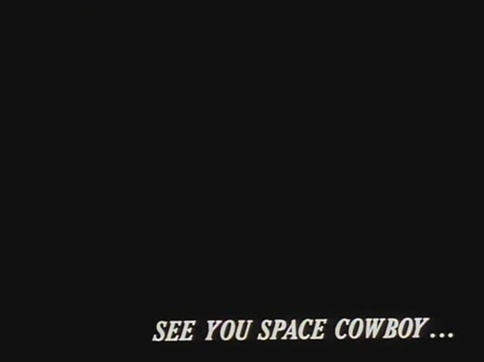

### Jerri Royland 51

["Hello World!"](https://jerrifaye.github.io/120-work/hw-3/)

# HW-3

#### *Project*
This week I started working with p5 and it feels somewhat familiar to the CSS coding I did a few years ago.  I remember the process of making changes and refreshing to see in the browser.

At first I didn't know what I wanted to do because it's such a simple project with so many possibilities.  But I quickly decided on replicating the Cowboy Bebop ending with the text in the bottom right corner of a black page.

#### *Progress*
In order to replicate a particular style I needed to find the codes for coloring and stylizing text.  It was easy to search for p5 codes and I found them in a matter of minutes.

#### *Issues*
When I first started the Hello World code I loaded the index page and nothing came up.  I found out I had an extra space between the canvas or background code and the round bracket.  Then that was working.

I moved on to the text and again nothing came up.  I forgot to put in the quotation marks.  I first passed them off as what would show up on screen, but when I noticed the Hello World was the same color as the brackets and commas I realized it was missing some code.  When I added the marks, it turned green and stood out from the rest of the code.

#### *Outcome*
It turned out well enough.  I decided to use a common font rather than attaching a special font since I'm not sure how yet.  And the CB image I found is not a great represenation of the original ending screen from the series.

  
  
