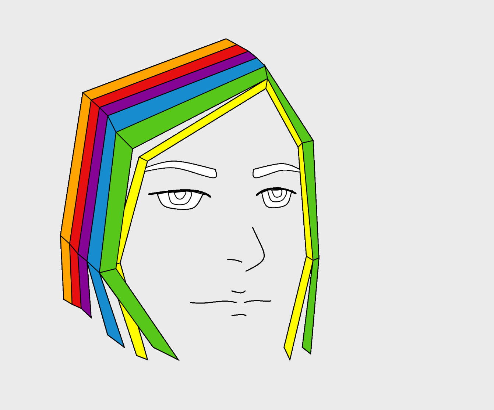

### Jerri Royland 50

["SelfPortrait"](https://jerrifaye.github.io/120-work/hw-4/)

# HW-4

#### *Self Portrait*
I love comic style line art so I immediately started out with the wrong kind of idea.  It was wrong for coding anyway because I wanted to create line art through plotting vertices and curves.  It was a lengthy project and I was pretty unsettled by the suspicion that there was a much, much easier way of doing it.  But I did it anyway.

I decided to do the hair in a sort of cubist style.  I liked the idea of interlocking rectangles in a rainbow pattern.

It took a long time to complete a rather simple drawing but aside from some proportion issues I'm satisfied with it.

  
