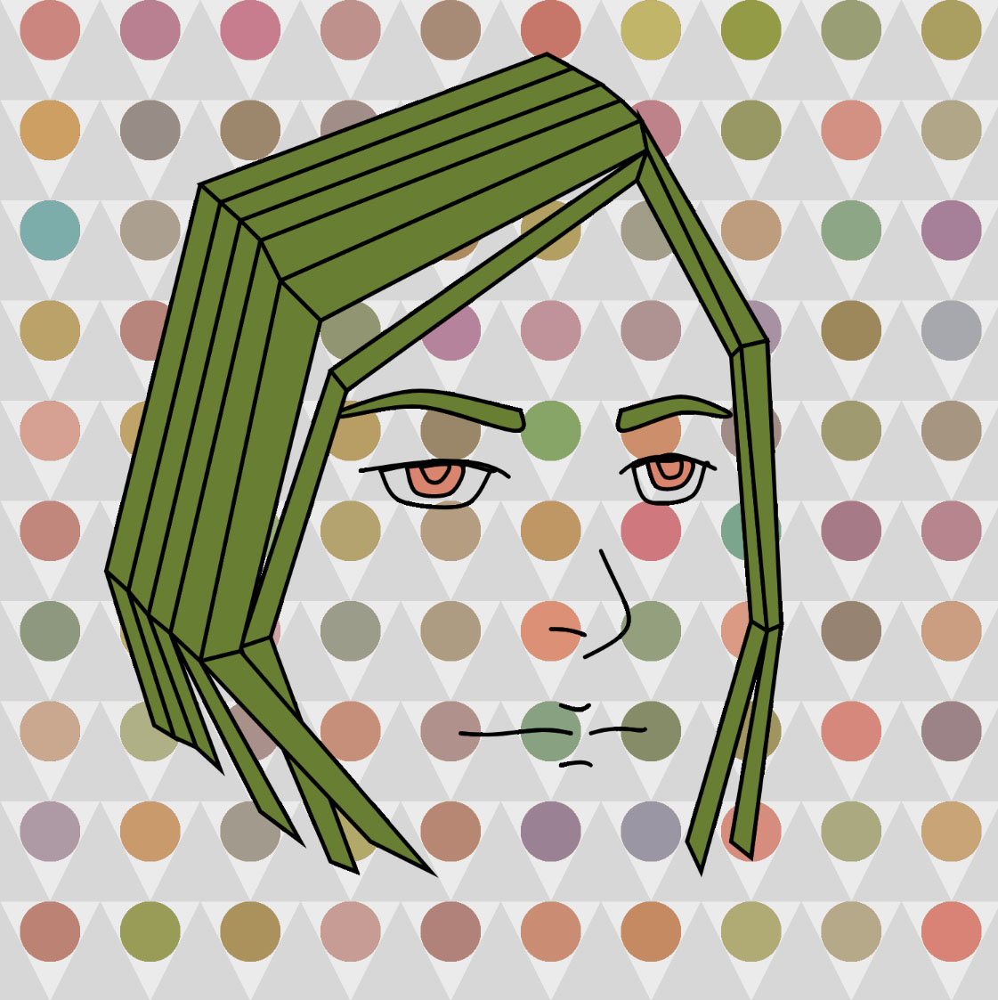
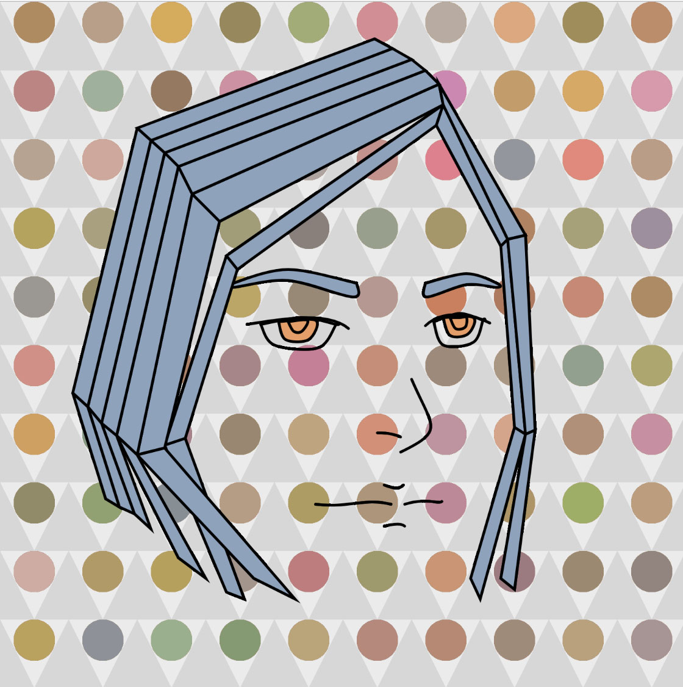
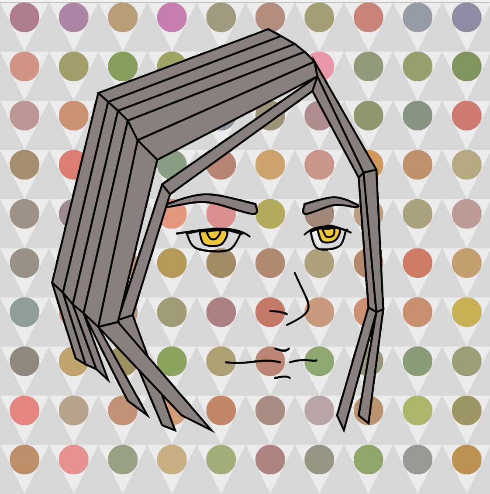
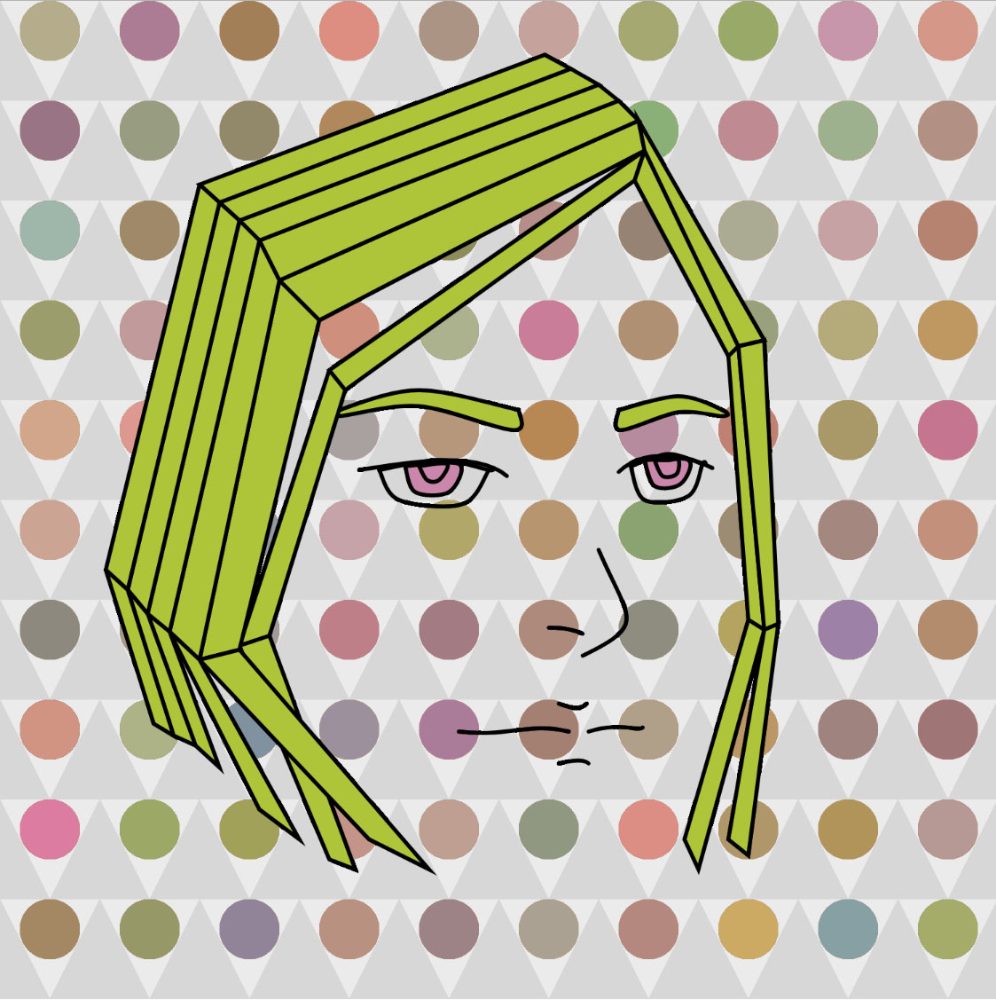
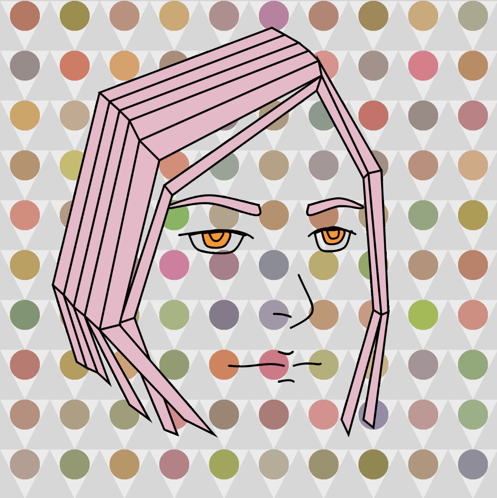
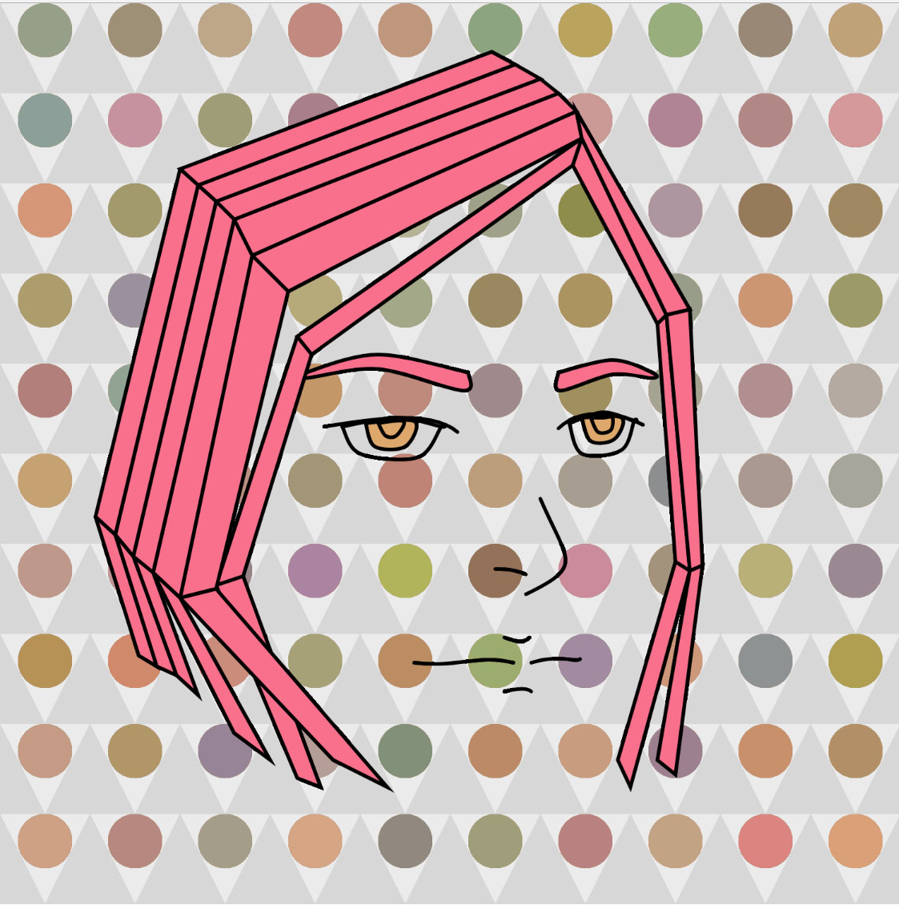

### Jerri Royland 50

["Animation"](https://jerrifaye.github.io/120-work/hw-5/)

# HW-5

#### *Self Portrait 2*

I decided to make the self portrait more interesting, since I already put so much work into it.  The first thing I did was fix the proportion issues that were bothering me.  I made the hair taller and a little wider so the head wasn't so flat.  I pushed the nose a little more to the left and made the right lip a little shorter.  The right eyebrow I pushed a little to the right.  Even the tiny changes made a big difference and I'm much happier with it.

Then I used my loop sketch from week 8 as the background.  The color was overpowering the line art so I made both the background and the triangles a light gray that were close in value.  I gave the ellipse color a transparency so it was bit more muted.

I had given the rainbow hair a darker hue and made it transparent so the pattern would show through.  But the pattern and rainbow colors didn't hold together well.  I gave all of the hair the same random color as the background.  At first I kept the eyebrows transparent but I gave them the same color as the hair.  The eyebrows are important markers on the face.

I also wanted to give the eyes a color.  So I rearranged the code hierarchy so I could give the same random color to the irises.  The pupils automatically took the same color which I didn't intend but I liked it.  I tried black pupils but it was too much contrast.  I also tried the eyes as white but it was too strong against the background.

I would still consider doing a jaw and some gray shading but I can't get myself to make anymore curves.

I really enjoy watching the changing colors.  It would be a really useful code for comic artists who are looking for hair and eye color combinations.  The same idea could be used for clothes too.  The frame rate could be even slower and the mouse click could stop the loop and freeze the sketch.

  
  
  
  
  
  
